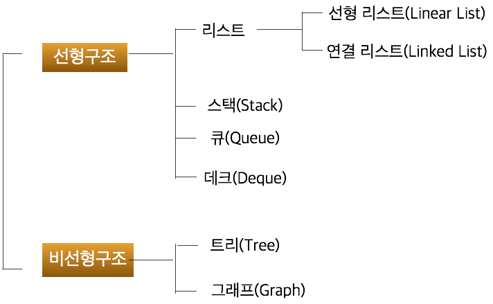

# CS_note
CS 공부, 면접 준비

## 네트워크

| 제목                        | Done |
| --------------------------- | ---- |
| HTTP vs HTTPS               |      |
| TCP vs UDP                  |      |
| OSI 7 layer                 |      |
| SPA                         |      |
| request method, GET vs POST |      |
| TCP/IP 통신 과정            |      |
| Proxy, Load balancing       |      |

## 자료 구조

| 제목                      | Done |
| ------------------------- | ---- |
| 스택 vs 큐 vs 덱          |      |
| 그래프 vs 트리            |      |
| 순차리스트 vs 연결 리스트 |      |

## 알고리즘

### Sort

- Bubble sort
- Counting sort
- Select sort
- **Quick sort** ⭐
- Merge sort
- Topology sort

### Search

- Linear search
- **Binary search** ⭐
- **Binary search tree **⭐

### Pattern matching

- Brute Force
- KMP
- **Boier mour** ⭐

### Graph

- DFS
- BFS
- MST
  - Kruskal
  - Prim
- Shortest path
  - Dijkstra
  - Bellan-Ford
  - Floyf-Warshall

### Etc

- Permutation
- Power set
- Combination

- Sieve of Eratosthenes
- Euclidean algorithm

## 프론트엔드

| 제목                                      | Done |
| ----------------------------------------- | ---- |
| React vs Vue                              |      |
| props, emit                               |      |
| 동기 vs 비동기 / blocking vs non blocking |      |
| 프레임워크 vs Library                     |      |
| package.json vs package-lock.json         |      |
| CORS                                      |      |
| token vs session                          |      |
| 디자인 패턴, 사용 이유                    |      |
| Rest API vs Socket 통신                   |      |
| WebRTC, stun/turn                         |      |
