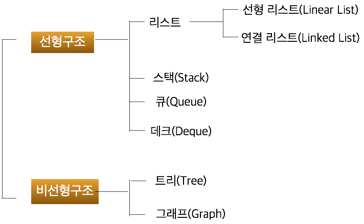

# CS_note
CS 공부, 면접 준비

## Common

- [좋은 코드란 무엇인가?](Common/좋은 코드란 무엇인가)
- [객체지향 프로그래밍](Common/객체지향 프로그래밍)

- [Object Oriented Programming](Common/Object Oriented Programming)

- [Restful API](Common/Restful API)

- [MVC패턴](Common/MVC패턴)

## Network

| 제목                                   | Done |
| -------------------------------------- | ---- |
| [HTTP vs HTTPS](Network/HTTP vs HTTPS) | ✅    |
| [TCP vs UDP](Network/TCP vs UDP)       | ✅    |
| [TCP handshake](Network/TCP handshake) | ✅    |
| OSI 7 layer                            |      |
| SPA                                    |      |
| request method, GET vs POST            |      |
| TCP/IP 통신 과정                       |      |
| Proxy, Load balancing                  |      |
| 대칭키 vs 공개키                       |      |

## Data Structure

| 제목                        | Done |
| --------------------------- | ---- |
| Array vs List vs LinkedList |      |
| 스택 vs 큐 vs 덱            |      |
| 힙, 이진 탐색 트리          |      |
| 그래프 vs 트리              |      |
| 해쉬                        |      |
| 트라이(trie)                |      |
| B-tree & B + Tree           |      |

## Algorithm

### Sort

- Bubble sort
- Counting sort
- Select sort
- **Quick sort** ⭐
- Merge sort
- Topology sort

### Search

- Linear search
- **Binary search** ⭐
- **Binary search tree **⭐
- LIS

### Pattern matching

- Brute Force
- KMP
- **Boier mour** ⭐

### Graph

- DFS
- BFS
- MST
  - Kruskal
  - Prim
- Shortest path
  - Dijkstra
  - Bellan-Ford
  - Floyf-Warshall

- LCA

### Etc

- Permutation
- Power set
- Combination

- Sieve of Eratosthenes
- Euclidean algorithm

## Web

| 제목                                      | Done |
| ----------------------------------------- | ---- |
| React vs Vue                              |      |
| props, emit                               |      |
| 동기 vs 비동기 / blocking vs non blocking |      |
| 프레임워크 vs Library                     |      |
| package.json vs package-lock.json         |      |
| CORS                                      |      |
| token vs session                          |      |
| 디자인 패턴, 사용 이유                    |      |
| Rest API vs Socket 통신                   |      |
| WebRTC, stun/turn                         |      |
| Webpack, 빌드                             |      |
| Redux, store                              |      |
| SSR vs CSR                                |      |
|                                           |      |

